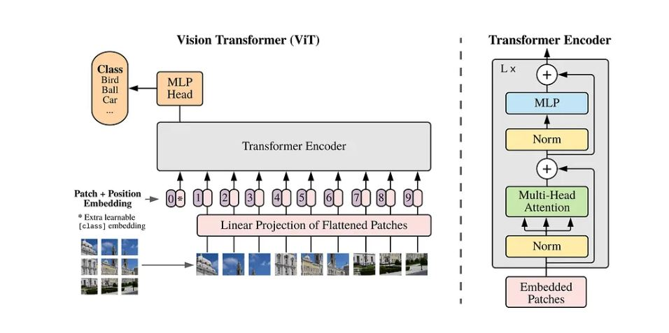
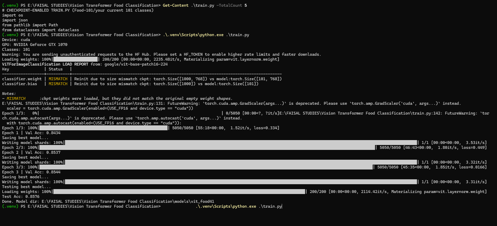
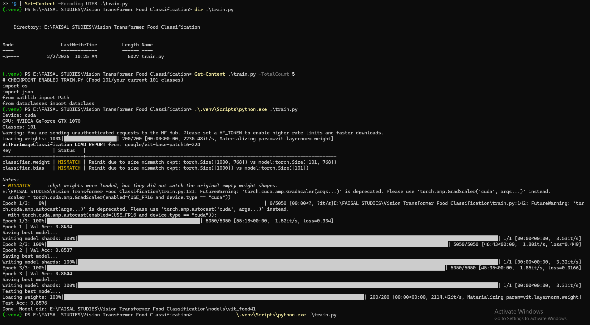
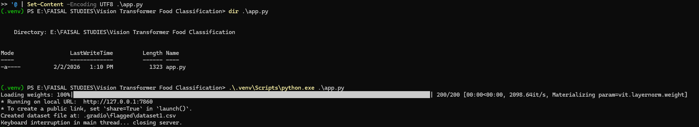
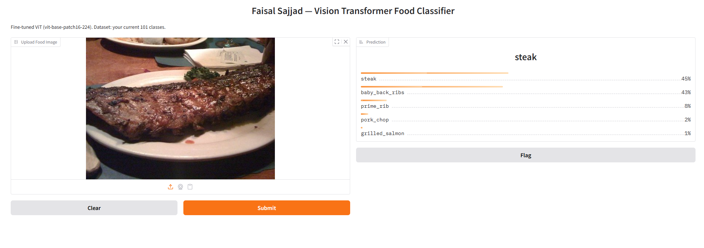
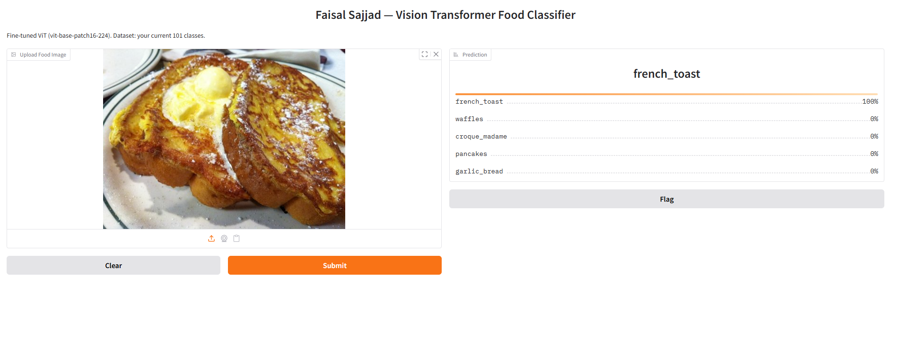
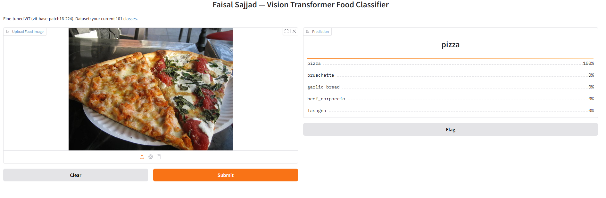
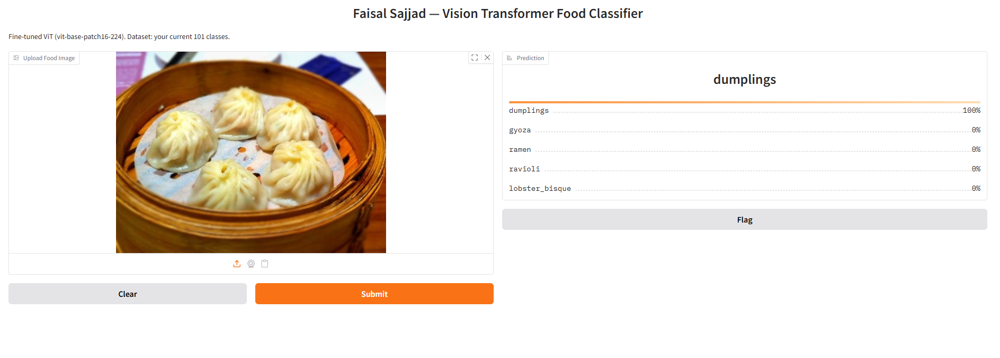
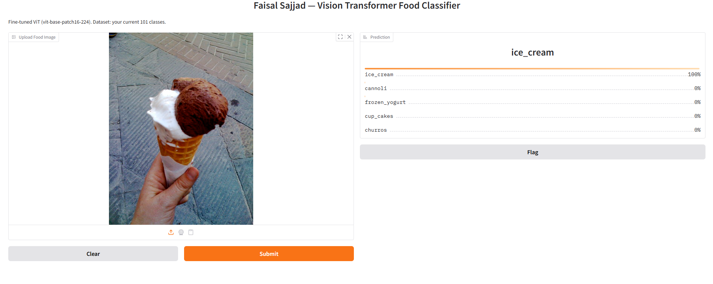

# Vision Transformer (ViT) for Food Classification

Fine-tuned **Vision Transformer (ViT)** for **food image classification** using **PyTorch**, **Hugging Face Transformers**, and an interactive **Gradio** demo.

---

## Project Overview

Food classification is useful for **nutrition analysis**, **diet tracking**, and **meal planning**.  
This project fine-tunes a **Vision Transformer (ViT)** model and serves predictions via a **Gradio web app**.

Unlike CNNs that rely mainly on local receptive fields, ViT treats an image as a sequence of **patch tokens** and learns global relationships using **self-attention**.

---

## Architecture Intuition

Transformers were originally designed for text (tokens). ViT applies the same idea to images:

1. Split image into fixed-size patches  
2. Linear projection + positional embeddings  
3. Transformer Encoder learns global relationships (self-attention)  
4. `[CLS]` token summarizes the image → MLP head predicts the class  

[](assets/README/architecture/vit.jpeg)

---

## Results

| Metric | Value |
|------:|:-----:|
| Best Val Accuracy | **~0.8544** |
| Test Accuracy | **~0.8576** |

> Tip: This accuracy is strong for a real-world food classification pipeline. Keep it visible — it builds trust.

---

## Pipeline Summary

### 1) Data Preprocessing & Split
- Dataset arranged in **class folders**
- Split into **train / val / test**
- Basic augmentations & normalization

### 2) Model Initialization
- Base model: Vision Transformer (ViT)
- Fine-tuned on food classes using Hugging Face Transformers

### 3) Fine-Tuning
- Optimizer: AdamW
- CrossEntropy loss
- Checkpoint/resume supported (if enabled in your code)

### 4) Evaluation
- Accuracy + sample predictions + training curves

---

## Project Structure

```
.
├─ assets/
│  └─ README/
│     ├─ architecture/
│     │  └─ vit.jpeg
│     ├─ training/
│     │  ├─ epoch_progress.png
│     │  ├─ training_complete.png
│     │  └─ gradio_running.png
│     └─ gradio/
│        └─ (sample predictions .png)
├─ split_dataset.py
├─ train.py
├─ app.py
└─ requirements.txt
```
---
## How to Run

### 1) Install Dependencies
> Make sure you are in the project folder (where `requirements.txt` exists).


pip install -r requirements.txt
### 2) Train the Model
   python train.py
### 3) Run the Gradio Demo
   python app.py
### 4) Open in Browser
http://127.0.0.1:7860

---

## Training & Demo Screenshots

### Training
**Epoch Progress**  


**Training Complete**  


### Gradio Demo
**Gradio Running**  


---

## Sample Predictions (Optional)

**chicken_wings**  


**steak**  


**eggs_benedict**  


**french_toast**  


**sushi**  


**pizza**  


**dumplings**  


**fried_rice**  


**hot_and_sour_soup**  


**ice_cream**  


---

## References & Resources

### Papers
- Attention Is All You Need — Vaswani et al.  
  https://arxiv.org/abs/1706.03762
- An Image is Worth 16×16 Words: Transformers for Image Recognition at Scale (ViT) — Dosovitskiy et al.  
  https://arxiv.org/abs/2010.11929

### Repositories
- Google Research — Vision Transformer (ViT)  
  https://github.com/google-research/vision_transformer
- lucidrains — vit-pytorch  
  https://github.com/lucidrains/vit-pytorch

### Documentation
- Hugging Face Transformers — ViT Documentation  
  https://huggingface.co/docs/transformers/en/model_doc/vit

---

## Citation

```bibtex
@article{dosovitskiy2020,
  title={An Image is Worth 16x16 Words: Transformers for Image Recognition at Scale},
  author={Dosovitskiy, Alexey and others},
  journal={arXiv preprint arXiv:2010.11929},
  year={2020}
}
